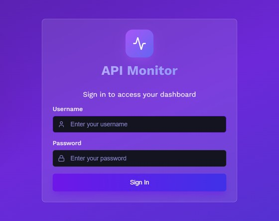
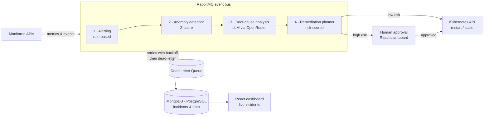
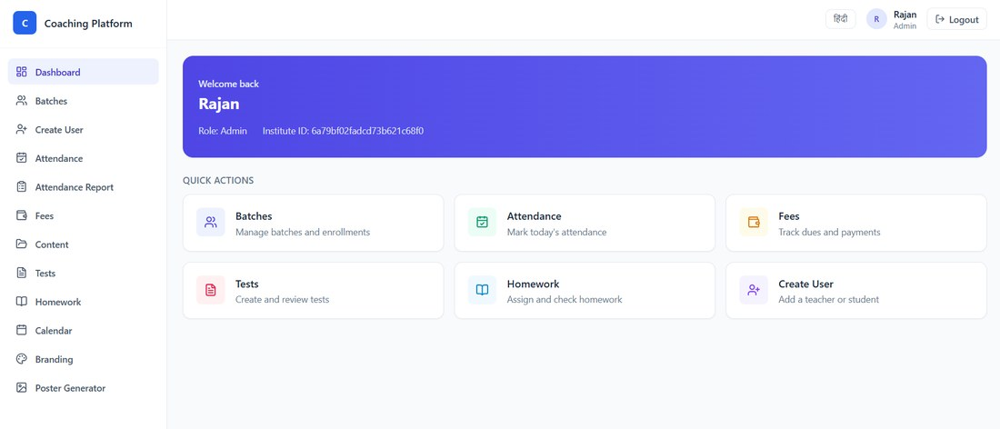
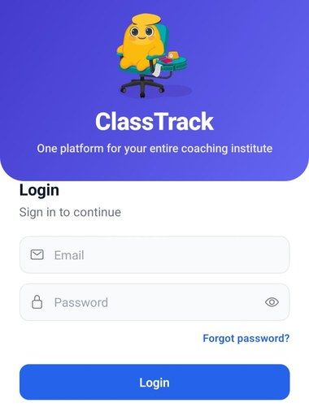
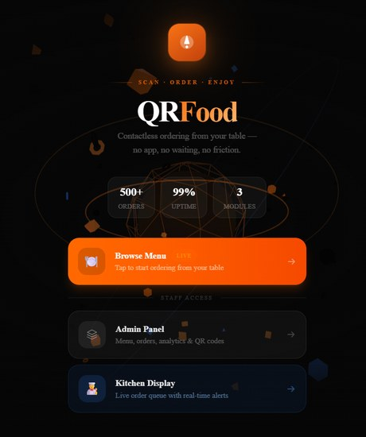
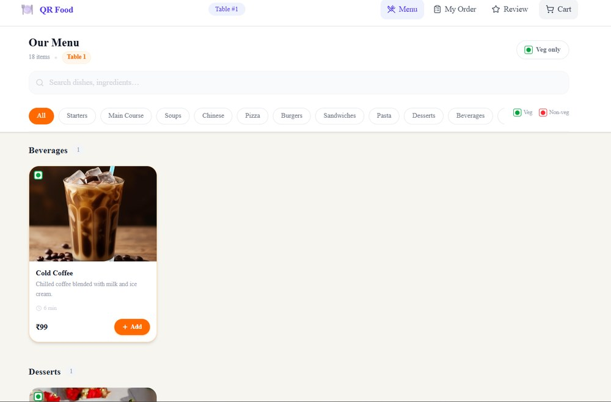

  

  

  
  
  
  
  

---

### 💫 About Me

- 🎓 Final-year B.Tech CSE student, building **production-ready systems**, not tutorial clones.
- 🧠 Core focus: **MERN stack + Agentic AI** — RAG, LangGraph workflows, tool-calling chatbots, event-driven architecture.
- 🛠️ Comfortable across the stack: React/Next.js on the frontend, Node.js/Express/FastAPI on the backend, MongoDB/PostgreSQL/Redis for data, Docker/Kubernetes for deployment.
- 🚀 Live demos and source code are linked under every project wherever they exist.
- 📫 Reach me: **cpsrajan2002@gmail.com**
- 💼 Open to: **MERN / Full-Stack Developer internships & entry-level roles**, especially at startups building AI-integrated products.

---

## 🔥 Featured Projects

### 🤖 AI-Augmented API Observability & Auto-Remediation Platform
> Event-driven API monitoring system with an AI layer that detects, diagnoses, and remediates production incidents.

- Built an event-driven microservices system on RabbitMQ, using a **Circuit Breaker**, retry-with-backoff, and **Dead Letter Queues** so a failing service doesn't quietly drop data.
- Added a **4-stage AI pipeline**: Z-score anomaly detection → LLM root-cause analysis → auto-restart/scale of the affected Kubernetes service, or human approval first when the fix looks risky.
- React dashboard to watch incidents and approve fixes live.
- Stack: `Node.js` `Express` `RabbitMQ` `MongoDB` `PostgreSQL` `React (Vite)` `Kubernetes` `OpenRouter LLM API`
- 🔗 [GitHub](https://github.com/rajankumarsingh01/api_monitoring_with_ai_agents)

  
   API Monitor dashboard (React + Vite)

<b>🧭 See the architecture</b>

<b>🧠 Design decisions</b>

 

**Why a human-approval step before some fixes?**  
Restarting or scaling a service is low-risk, but some fixes can make an outage worse. Each fix is risk-scored: low-risk ones run automatically, high-risk ones wait for approval on the dashboard.

**Why a Circuit Breaker, retries and Dead Letter Queues?**  
So a failing service never quietly drops data. Messages are retried with backoff, and anything that still fails is dead-lettered where it can be inspected instead of being lost.

**Why detect anomalies with Z-score before calling the LLM?**  
A cheap statistical check decides *when* something is wrong, so the LLM is only asked to explain real anomalies instead of every metric.

---

### 🎓 Kaksha — Multi-Tenant Coaching Institute SaaS + Agentic AI Microservice
> SaaS platform for coaching institutes across 5 roles, with a RAG-based AI doubt tutor running as its own service.

- Multi-tenant platform with per-institute data isolation, JWT access/refresh auth across 20+ modules, Razorpay payments, and a companion React Native (Expo) Android app.
- AI split into a separate **FastAPI + LangChain/LangGraph microservice**, called by the Node backend over internal HTTP.
- Doubt tutor answers from the institute's own notes using **RAG over MongoDB Atlas Vector Search**; a LangGraph flow retrieves, answers, then self-checks before replying.
- Also: AI question generator with a second validation pass, and a small custom eval script (RAGAS was too heavy for the free-tier setup).
- Stack: `Node.js` `Express` `MongoDB` `React` `React Native (Expo)` `FastAPI` `LangGraph` `Razorpay`
- 🔗 [Live Demo](https://coaching-management-system-three.vercel.app/) • [GitHub](https://github.com/rajankumarsingh01/coaching_management_system) • [Android APK](https://expo.dev/accounts/rajankumarsingh/projects/sankalp/builds/35ebd860-dfad-4056-91d1-105a7ff1810d)

  
  
   Admin web dashboard (React) and companion Android app (React Native)

<b>🧠 Design decisions</b>

 

**Why is the AI a separate FastAPI service?**  
The LangChain/LangGraph stack is Python-first, and keeping it out of the Node backend lets the core platform and the AI side change and deploy independently. The backend calls it over internal HTTP.

**Why RAG instead of a plain LLM answer?**  
The tutor should answer from the institute's own notes, not from general knowledge. A LangGraph flow retrieves, answers, then checks itself before returning.

**Why a custom eval script instead of RAGAS?**  
RAGAS was too heavy for the free-tier setup, so a small script covers what was actually needed.

---

### 🍽️ QR Food Ordering System
> QR-based restaurant ordering platform with a tool-calling AI chatbot and real-time order tracking.

- Deployed end-to-end (Vercel + Render); customers scan → browse → chat with an AI assistant → pay → track live.
- AI chatbot (Gemini via OpenRouter) uses **native function-calling** (`search_menu`, `get_order_status`) with Redis-backed session memory — grounded in real data, not hallucinated.
- **76 automated tests** (Jest + Supertest) with a GitHub Actions CI/CD pipeline; Sentry error monitoring in production.
- Stack: `Next.js` `TypeScript` `Node.js` `MongoDB` `Redis` `Socket.IO` `Razorpay`
- 🔗 [Live Demo](https://qr-food-ordering-system-nine.vercel.app) • [GitHub](https://github.com/rajankumarsingh01/qr_food_ordering_system)

  
  
   Landing page with customer, admin and kitchen entry points, and the table-side menu

<b>🧠 Design decisions</b>

 

**Why function-calling instead of a free-form chatbot?**  
`search_menu` and `get_order_status` fetch real data, so answers come from the live menu and order state instead of guesses.

**Why Redis for chat memory?**  
Session context needs to be fast and short-lived, so Redis keeps it per session without touching the main database.

---

<b>📦 More Projects</b> (click to expand)

 

| Project | Description | Stack | Links |
|---|---|---|---|
| **DocFinder** | Claim-based platform to recover lost documents across India | React, Node.js, MongoDB, Cloudinary | [Live](https://docfounder-india.vercel.app/) • [GitHub](https://github.com/rajankumarsingh01/docfounder_india) |
| **AI Interview Platform** | Voice-interactive AI mock-interview tool with performance analytics | React, Node.js, Firebase, OpenRouter | [Live](https://ai-interview-platform-client.onrender.com/) • [GitHub](https://github.com/rajankumarsingh01/AI_Interview_Platform) |

---

## 🛠️ Tech Stack

**Languages:**   

**Frontend:**    

**Backend:**    

**Databases:**   

**AI / Agentic:**    

**DevOps:**    

---

## 🌱 Currently Exploring

-326CE5?style=flat-square&logo=kubernetes&logoColor=white)  

Deepening my understanding of container orchestration, multi-agent AI pipelines, and distributed system design — going beyond "it works" to "I can explain every design decision."

---

## 📈 GitHub Activity

  

### 🕒 Recently shipped

<!--RECENT_ACTIVITY:START-->
- [**sarkari-yojana-finder**](https://github.com/rajankumarsingh01/sarkari-yojana-finder) · _pushed 1d ago_
- [**secret-chat-app**](https://github.com/rajankumarsingh01/secret-chat-app) · _pushed 2d ago_
- [**Mern_Portfolio**](https://github.com/rajankumarsingh01/Mern_Portfolio) · _pushed 3d ago_
- [**devmark**](https://github.com/rajankumarsingh01/devmark) · _pushed 4d ago_
- [**rajan-copilot**](https://github.com/rajankumarsingh01/rajan-copilot) — AI-powered dev copilot — built phase-by-phase while learning Agentic AI · _pushed 16d ago_
<!--RECENT_ACTIVITY:END-->

  Building at the intersection of full-stack engineering and agentic AI — one deployed project at a time.

